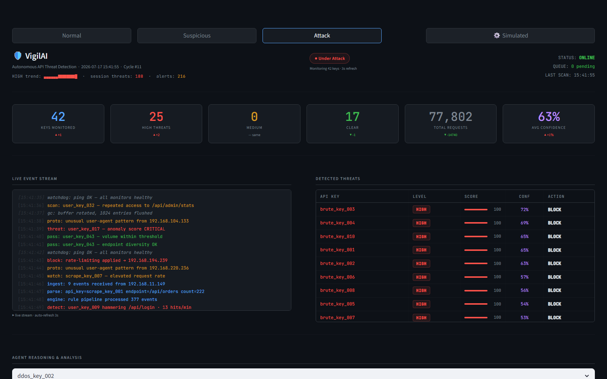
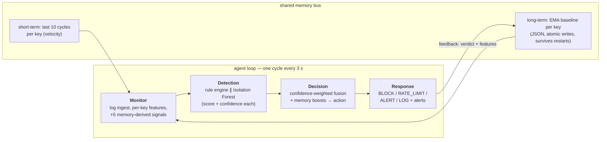

# Vigil AI — Autonomous API Abuse Detection


[](https://www.producthunt.com/products/vigil-ai)

Vigil detects and responds to API abuse without a human in the loop: four agents
(**Monitor → Detection → Decision → Response**) run a continuous cycle that fuses
unsupervised anomaly detection (Isolation Forest) with a SOC-style rule engine,
weighted by each engine's own confidence. Per-key behavioral memory persists across
restarts, so repeat offenders escalate automatically — and every verdict carries a
full reasoning trace stating which signals fired and with what confidence.

[Launched on Product Hunt](https://www.producthunt.com/products/vigil-ai) · [landing page](https://vigil-landing-page.vercel.app)



## Architecture



Per key, the feature vector is `total_requests, average_requests, unique_endpoints,
request_variance` ([src/feature_extractor.py](src/feature_extractor.py)), enriched by
[MonitorAgent](src/agents/monitor_agent.py) with five memory signals: request
velocity, deviation from the key's own baseline, repeat-offender flag, historical
average, and prior observation count.

## Detection design

**Why Isolation Forest** ([src/detector.py](src/detector.py)) — abuse detection has
no labeled training data, so the model must be unsupervised. Isolation Forest fits:
it isolates points by random splits, and outliers separate in fewer splits, so it
scores "how unlike the rest of this population is this key" directly — no density
estimation, cheap on a 4-dimensional feature space (100 trees, `contamination=0.2`,
standardized features). It is retrained **every cycle on that cycle's population**,
which is deliberate: the question is "which keys deviate from current traffic," not
"does traffic match a frozen historical model." Scores are min–max normalized to
0–100 per cycle, i.e. outlier-ness is *relative to the current population* — a
property with a known failure mode (see limitations).

**EMA behavioral memory** ([src/memory/long_term.py](src/memory/long_term.py)) —
long-term memory keeps, per API key: an EMA-form baseline of `average_requests`
(`avg ← (1−α)·avg + α·x`), cumulative HIGH-verdict count, last decision, and
first/last-seen timestamps — persisted as JSON with atomic `os.replace()` writes so
a crash mid-write can't corrupt the store. The EMA-form update exists for its
mechanics: O(1) per update with no stored history, versus a simple average that
needs every past observation retained. As currently parameterized (`α = 1/(n+1)`)
it equals the incremental mean of all observations; a constant α is the one-line
switch to recency-weighting. The baseline drives two signals: percentage deviation
of current behavior from the key's own history, and repeat-offender status
(≥3 lifetime HIGH verdicts).

**Confidence-weighted fusion** ([src/core/confidence.py](src/core/confidence.py)) —
each engine's 0–100 score is mapped to a confidence `|score − 50| / 50`: 50 means
"I don't know" (confidence 0), while 0 or 100 mean certainty (confidence 1). The
fused score is the confidence-weighted average, so an ambiguous engine effectively
abstains rather than dragging a certain engine toward the middle — naive averaging
of rule = 95, ML = 50 gives 72.5; confidence weighting gives ≈ 95. Memory boosts
are then added ([src/agents/decision_agent.py](src/agents/decision_agent.py)):
**+18** repeat offender, **+12** velocity > 30 across the 10-cycle window, **+10**
deviation > 60 % from the key's baseline. Verdicts: fused ≥ 65 → HIGH (always
BLOCK), ≥ 35 → MEDIUM (BLOCK for repeat offenders, else RATE_LIMIT), LOW → ALERT
if the ML flagged an outlier or velocity spiked, else LOG.

## What it catches

Four traffic profiles, as generated by [src/simulator.py](src/simulator.py) and
observable live in the dashboard:

| Pattern | Concrete behavior | Dominant signals |
|---|---|---|
| **Brute force** | 200–800 requests hammering `/api/login` only, within a 5-minute spread | extreme volume + endpoint diversity of exactly 1 |
| **Scraping** | 50–300 requests methodically sweeping all 10 endpoints over ~20 min | high volume with *healthy-looking* diversity — ML outlier score does the work |
| **DDoS** | 1,000–5,000 requests in a ≤30 s burst against expensive endpoints (`/api/products`, `/api/recommendations`) | every signal fires; velocity boost accelerates the BLOCK |
| **Normal** | 1–15 requests, varied endpoints, human timing over an hour | baseline population the outliers are measured against |

Every verdict is explainable:

```
[HIGH | conf=95% | fused=97.6] — rule engine: high-volume/low-diversity (score 95);
ML: statistical outlier (anomaly 91.2); short-term memory: velocity spike +70;
long-term memory: >=3 prior HIGH verdicts (repeat offender).
```

## Known blind spots

Stated because they are inherent to the design, not oversights:

- **Ambiguity camping.** Confidence weighting creates an adversarial surface: an
  attacker pacing requests to keep both engine scores near 50 makes both engines
  abstain — the fused score parks in MEDIUM and never reaches BLOCK unless the
  repeat-offender counter accumulates.
- **Distributed abuse.** All features are per-API-key. An attacker rotating across
  hundreds of keys, each individually under threshold, is invisible — there is no
  cross-key or per-IP correlation layer.
- **Population-relative scoring.** Because the forest retrains per cycle with fixed
  contamination and per-cycle score normalization, a coordinated attack that makes
  abusive traffic the *majority* redefines "normal" and dilutes every outlier score.
- **Payload blindness.** Features are volumetric (counts, diversity, variance).
  Credential stuffing at human request rates, or business-logic abuse inside
  individually normal requests, produces no signal.

## Run it

```bash
git clone https://github.com/NSK-394/Vigil-AI.git && cd Vigil-AI
pip install -r requirements.txt
python -m streamlit run src/dashboard.py     # SOC dashboard → localhost:8501
```

Headless alternative: `python run_agent.py --mode attack --cycles 10`.

To monitor a real API instead of the simulator, add the drop-in
[FastAPI](src/middleware/fastapi_middleware.py) or
[Express](src/middleware/express_middleware.js) middleware and start the ingest
server (`uvicorn src.middleware.ingest_server:app --port 9000`) — live traffic flows
through a cross-process SQLite WAL queue into the same agent loop, and BLOCK
verdicts fire Slack/Gmail alerts ([.env.example](.env.example)).

## Production parallels

| Vigil component | Enterprise equivalent |
|---|---|
| DetectionAgent | SIEM correlation engine (QRadar, Sentinel) |
| DecisionAgent | SOAR playbook engine (XSOAR, Splunk SOAR) |
| ResponseAgent | WAF enforcement (AWS WAF, Cloudflare) |
| Long-term memory | Threat-intel database (MISP) |
| Reasoning traces | SOC analyst audit trail |
